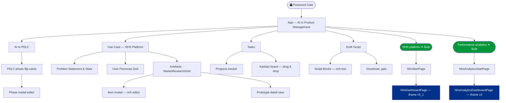

# Refine Problem Statement

A React + Vite app for documenting and collaborating on product problem statements, personas, and the full Product Development Lifecycle (PDLC). Data is persisted via Firebase and deployments are hosted on Vercel.

---

## Local Development

This project uses **pnpm** as the package manager (not npm). Use `pnpm` for all commands.

```bash
# Install pnpm if you don't have it (one-time setup)
npm install -g pnpm

# Install dependencies (only needed once, or after package changes)
pnpm install

# Start the dev server
pnpm dev
```

The app will be available at **http://localhost:5173**. Changes hot-reload automatically.

> **Common mistake:** Running `npm run dev` will fail with "Missing script: dev" because npm looks for `package-lock.json` which doesn't exist — this project uses `pnpm-lock.yaml`. Always use `pnpm`.

> **Tip:** Always run locally and verify before promoting to production. See the [Promoting to Production](#promoting-to-production) section below.

---

## Branching Workflow

| Branch | Purpose | Deploys to |
|---|---|---|
| `develop` | Active development | Vercel **preview** only |
| `main` | Production-ready code | Vercel **production** |

All work goes on `develop`. You never push directly to `main` — the `promote` script handles that after a local review.

```
develop  →  (npm run promote)  →  main  →  Vercel production
```

---

## Promoting to Production

When you are happy with your changes on `develop` and have reviewed them locally:

```bash
# Make sure all changes are committed first
git status

# Run the promotion script
npm run promote
```

The script will:
1. Verify the working tree is clean and you are on `develop`
2. Pull the latest from `upstream/develop`
3. Run `npm run build` to catch compile errors
4. Ask you to confirm you have reviewed the app at **http://localhost:5173**
5. Merge `develop → main` and push to `upstream` — this triggers the production deploy on Vercel

> **Do not push to `main` directly** — always use `npm run promote` so the build and local review are enforced.

---

## Running Tests

```bash
# Headless (against production)
npm test

# Against a custom URL
BASE_URL=https://your-preview-url.vercel.app npm test

# Headed (visible browser)
npm run test:headed

# View last report
npm run test:report
```

---

## App Architecture



---

## CI / CD

Every push and pull request triggers the pipeline in `.github/workflows/ci.yml`:

1. Deploys a **Vercel preview** build
2. Runs the **Playwright acceptance tests** against the preview URL
3. If tests pass **and** the branch is `main`, promotes the preview to **production**

Production is never updated if tests fail.

### Required GitHub Secrets

Add these under **Settings → Secrets and variables → Actions**. Never commit tokens directly to the repository — always use GitHub Secrets or local config files that are git-ignored.

| Secret | Purpose | Where to get it |
|---|---|---|
| `VERCEL_TOKEN` | Deploys previews and production | vercel.com → Account Settings → Tokens |
| `VERCEL_ORG_ID` | Identifies the Vercel org | `team_po7vlKOkbokM2AaiS5pxANXP` |
| `VERCEL_PROJECT_ID` | Identifies the Vercel project | `prj_1RJWubmmBe9GIdIKgxbF3mgGM70S` |
| `ATLASSIAN_TOKEN` | Jira / Confluence API access | id.atlassian.com → Security → API tokens |

---

## Figma MCP

To enable the Figma MCP integration, generate a personal token at **figma.com → Account Settings → Personal access tokens** and add it to your local MCP config.

> **Never commit tokens to the repository.** Revoke and regenerate any token that has been pushed.

Store tokens locally only — never in source:
- **Figma:** add to local MCP config (`~/.claude/mcp_config.json` or equivalent)
- **Atlassian:** add as `ATLASSIAN_TOKEN` in GitHub Secrets (for CI) or a local `.env` file (git-ignored)

---

## Production URL

[https://refine-problem-statement.vercel.app](https://refine-problem-statement.vercel.app)